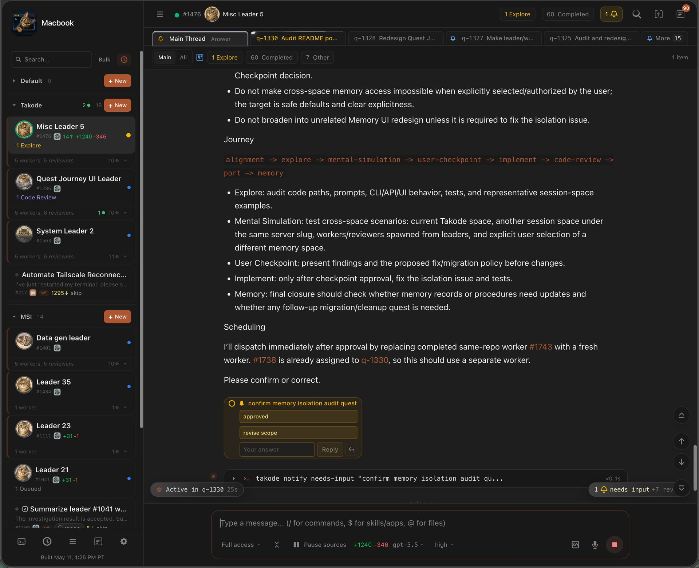
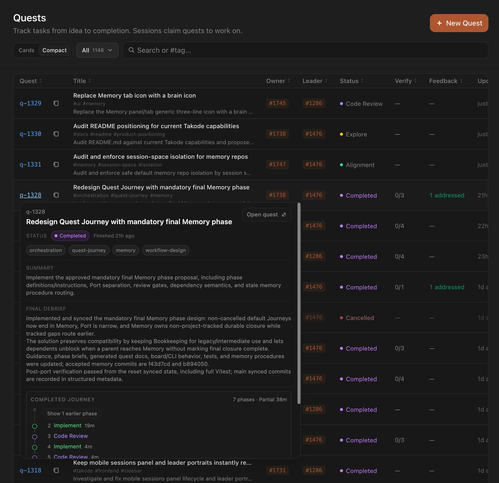
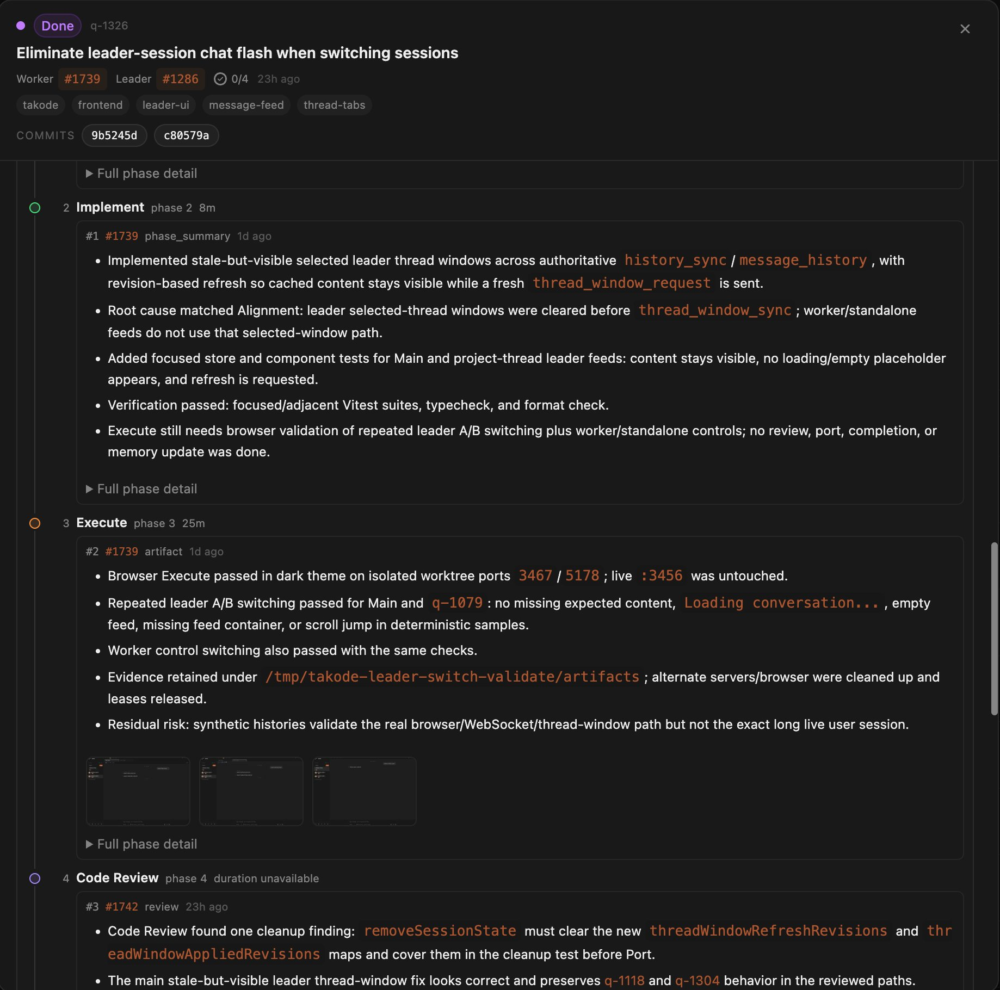
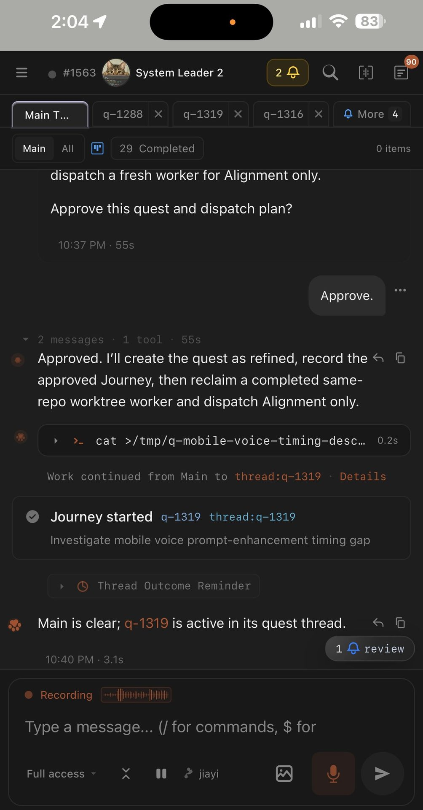
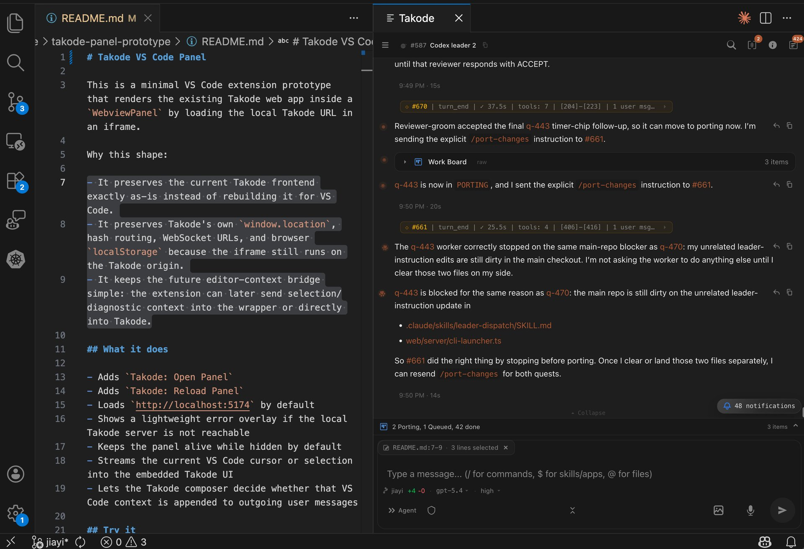
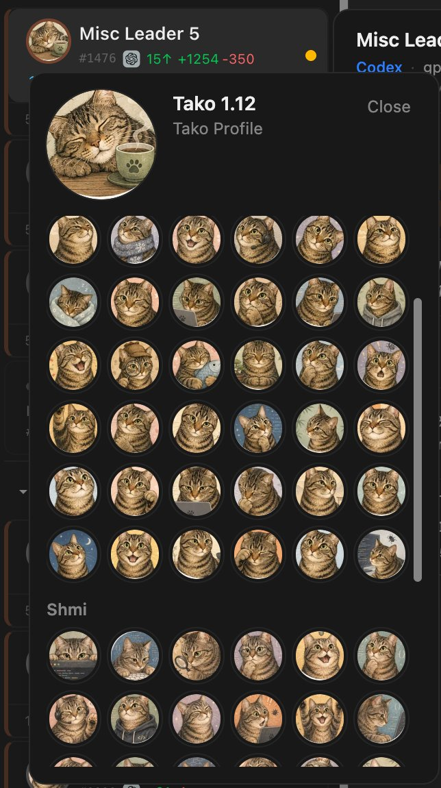

<p align="center">
  
</p>

<h1 align="center">Takode</h1>
<p align="center"><strong>Orchestrate Claude Code and Codex agents from one local control room.</strong></p>
<p align="center">Takode gives leader agents a place to turn requests into quests, coordinate workers and reviewers, and keep each Quest Journey visible while you stay in control. It is also a comfortable home for direct Claude Code and Codex sessions when one agent is enough.</p>

<p align="center">
  <a href="LICENSE"></a>
</p>

Takode keeps local agent work organized, inspectable, and easy to return to:

- **Leader-managed orchestration** across multiple workers, reviewers, quests, and phases
- **Visible Quest Journeys** so scope, ownership, review, checkpoints, and handoffs do not disappear into chat
- **Permanent quest records** with human TLDRs, full agent notes, verification state, and searchable history
- **One consistent UI** for Claude Code and Codex sessions, including direct single-session work
- **Local-first control**: your project files, session state, quest state, and history stay on your machine

The model provider behind Claude Code or Codex is the external dependency. Takode itself does not require a hosted backend.

---

## Orchestrate More Than One Agent

Direct sessions are great for focused tasks. Bigger autonomous work gets harder to trust when the scope lives only in a prompt, no reviewer checks the result, parallel workers lack shared context, and useful notes stay buried in chat.

Takode's strongest workflow starts with a **leader session**. Give the leader a request, screenshot, bug report, or quest, and it can organize the rest of the work:

1. Turn the request into one or more persistent quests
2. Sketch the scope and success criteria before work starts
3. Dispatch workers, usually in isolated git worktrees
4. Route code review, outcome review, or mental simulation to reviewer sessions
5. Share quest context across related workers
6. Stop for user checkpoints when the direction needs your decision
7. Port accepted tracked changes and close durable state in final Memory

The Work Board and quest tabs show what is active, who owns it, which phase it is in, what is waiting, and what has already finished. You do not have to reconstruct progress from a long terminal transcript.

## Quests Are Units of Orchestrated Work

When work should outlive one chat turn, Takode tracks it as a **quest**: a durable task with status, ownership, feedback, screenshots, verification, phase notes, and a final debrief.

<p align="center">
  
</p>

Quests are more than issue rows. They are the units that leader agents orchestrate.

Each Quest Journey gives the task enough structure to make more autonomous work easier to trust:

- **Who does what**: leader, worker, reviewer, or user checkpoint
- **What good looks like**: alignment, scope, success criteria, and the phase responsibilities for the work
- **What evidence matters**: code review findings, browser evidence, external results, user decisions, synced changes, or durable-state updates
- **When to challenge the work**: reviewer phases can check correctness, missing tests, maintainability, UX evidence, or workflow risks before acceptance
- **Where the story lives**: phase notes, TLDRs, reviews, and debriefs stay attached to the quest instead of disappearing into raw session history

For tracked code changes, the normal path is:

`alignment -> implement -> code-review -> port -> memory`

More complex work can add phases like `explore`, `mental-simulation`, `execute`, `outcome-review`, or `user-checkpoint`. Work with no tracked code changes can omit `port`, but non-cancelled quests still finish with final `memory` closure.

## Completed Work Becomes Searchable Project Memory

Agents document the work on the quest as the Journey progresses. Each phase can carry a short TLDR for humans and fuller notes for future agents.

<p align="center">
  
</p>

That makes a quest easier to review than raw conversation history. You can scan the Journey, expand the details when needed, and see why decisions were made.

Completed quests become project memory in a practical sense: durable, searchable records that future agents can inspect when they need prior context. Final Memory closure also gives agents a place to settle file-based memory updates, deferrals, stale-state checks, cleanup, and follow-up routing. It is not magic model memory; it is explicit durable state.

## Direct Sessions Still Matter

You do not need a leader workflow to make Takode useful.

For focused one-session work, Takode gives the same local tools a clearer surface:

- grouped, readable tool calls in chat
- permission controls and visible approval paths
- persistent session history that survives restarts
- easier switching across many sessions and projects
- one UI for both Claude Code and Codex
- mobile access when you need to check progress or answer a prompt away from your desk

<p align="center">
  
</p>

Every session is a real Claude Code or Codex instance with its own conversation, working directory, and git branch. Takode makes those sessions easier to inspect, route, and control.

## Find and Steer Work

Takode is designed so humans and agents can both operate the workspace.

- **Universal Search** helps find sessions, threads, messages, quests, and quest actions
- **Notifications** surface needs-input prompts, review-ready work, and other attention points
- **Quest and session links** preserve context so leader, worker, and quest views stay connected
- **CLI tools** expose major Takode workflows to agents, so leader sessions can coordinate workers without relying only on the graphical UI

## Local Control and Integrations

Takode runs on your machine and works with local project directories:

- your sessions run locally
- your files stay local
- your session coordination, quest state, file-based memory, and history stay under your control
- there is no Takode-hosted backend you have to trust with your code

The model-provider CLI you choose remains the external service.

Also included:

- **Permission controls**: run in agent mode or plan mode, with optional per-tool approvals
- **Voice input**: dictate prompts directly in the app
- **Pushover notifications**: optional push alerts for events that need attention
- **VS Code integration**: Takode can install its VS Code extension, and editor selections can stream into Takode while the app is open in a browser

<p align="center">
  
</p>

---

## Quick Start

**Requirements:** [Bun](https://bun.sh) and either [Claude Code](https://docs.anthropic.com/en/docs/claude-code) or [Codex](https://github.com/openai/codex) CLI installed and already authenticated.

```bash
git clone https://github.com/MrVPlusOne/takode.git
cd takode && bun install --cwd web --frozen-lockfile
make serve
```

`make serve` starts the local Takode server and web app.

Then:

1. Open <http://localhost:3456>
2. Create a session
3. Choose Claude Code or Codex as the backend
4. Select the local project directory you want the session to work in
5. Start chatting, or start a leader session when you want orchestration

Takode runs locally. The only required third-party service is the model provider behind the CLI you choose.

---

## Development

```bash
# Install web dependencies once before the first local dev run,
# and rerun after pulling dependency changes
bun install --cwd web --frozen-lockfile

# Dev server (backend :3456 + Vite HMR :5174)
make dev

# Type checking and tests
cd web && bun --no-install run typecheck && bun --no-install run test

# Production build
cd web && bun --no-install run build && bun --no-install run start
```

`make dev` assumes the `web/` dependencies are already installed. On a fresh
clone or after dependency changes, run `bun install --cwd web --frozen-lockfile`
first. See [Dependency and Install Policy](docs/dependency-policy.md) for lockfile
review, exact-version, and package update expectations.

## Documentation

- [Changelog](CHANGELOG.md)
- [WebSocket Protocol Reference](WEBSOCKET_PROTOCOL_REVERSED.md)
- [Architecture & Contributor Guide](CLAUDE.md)
- [Dependency and Install Policy](docs/dependency-policy.md)
- [Feed and Thread Debugging Guardrails](docs/feed-thread-debugging.md)

## Name

Takode is named after my cat Tako. The cat portraits for leader sessions are a small nod to him, and a reminder that orchestration can still have a bit of personality.

<p align="center">
  
</p>

## Origin

Takode started as a fork of [The-Vibe-Company/companion](https://github.com/The-Vibe-Company/companion) and has since heavily diverged with its own architecture and feature set.

## License

MIT
