<p align="center">
  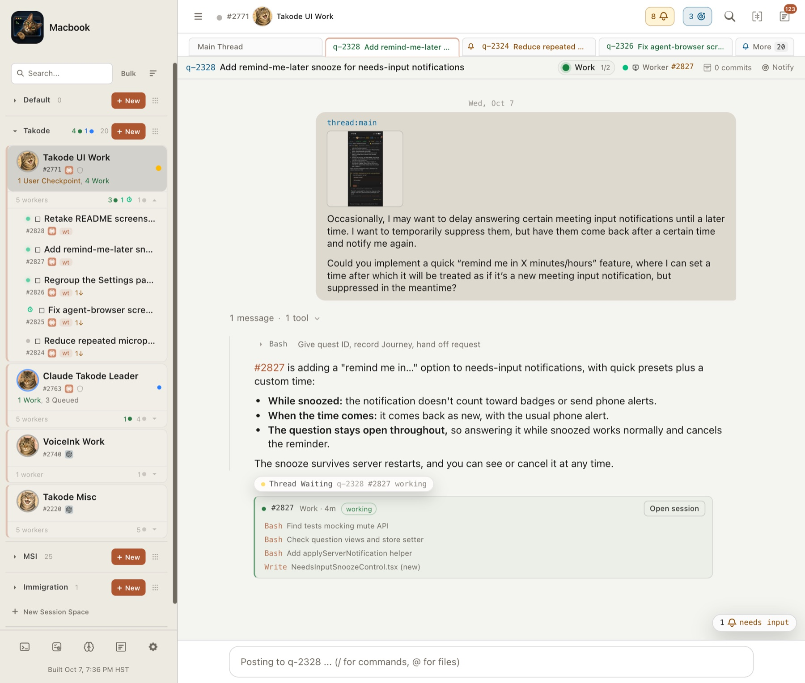
</p>

<h1 align="center">Takode</h1>
<p align="center"><strong>Run a team of Claude Code and Codex agents from a few leader sessions.</strong></p>
<p align="center">Tell a leader what you want. It turns the request into a quest, starts workers in isolated git worktrees, keeps an eye on them, and reports back when there is something to decide or review. You steer the work instead of babysitting sessions.</p>

<p align="center">
  <a href="LICENSE"></a>
</p>

## Why Takode

One agent in one terminal is easy to follow. Ten agents across five tabs is not: you end up checking each one, re-explaining context, and wondering which of them is waiting on you. Takode moves that bookkeeping to leader sessions so you only deal with what needs a human.

- **Talk to a few leaders, not dozens of sessions.** Leaders create quests, pick or spawn workers, send follow-ups, and collect results. Hand one a batch of quests and it sorts out the order and dependencies.
- **See everything at a glance.** Workers sit under their leader in the sidebar, each quest gets its own tab, and a live card shows what a worker is doing right now.
- **Only get pulled in for decisions.** Questions from every session land in one inbox, with reply buttons, and can ping your phone.
- **Work leaves a record.** Every quest keeps its scope, phase notes, review results, commits, and a final summary you can search later.
- **Claude Code and Codex, side by side.** Choose the backend per session and manage both from the same UI, on desktop or phone.
- **One team across several machines.** Run some sessions on a cloud workspace or a GPU box, and keep them under the same leaders, quests, and inbox as the rest.
- **Runs on your own hardware.** No Takode-hosted backend; your code, sessions, and quest history stay on machines you control.

---

## How a Leader Runs Your Work

**1. Ask.** Describe a bug, paste a screenshot, or point at an existing quest. The leader writes it up as a quest, dispatches a worker in its own worktree, and keeps your conversation in a tab for that quest. A live card shows the worker's latest steps without opening its session.

<p align="center">
  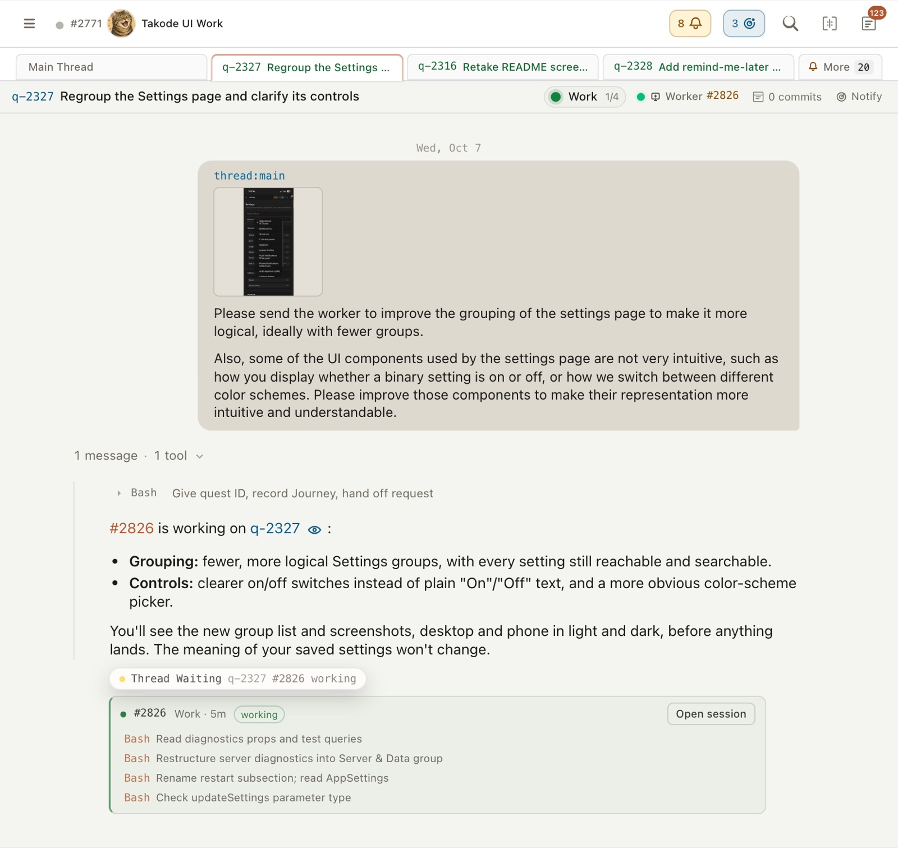
</p>

**2. Decide when asked.** If the work needs your call (a design choice, an approval, a missing detail), the leader asks with suggested replies. Everything else, such as follow-ups, reviews, and retries, happens between agents.

<p align="center">
  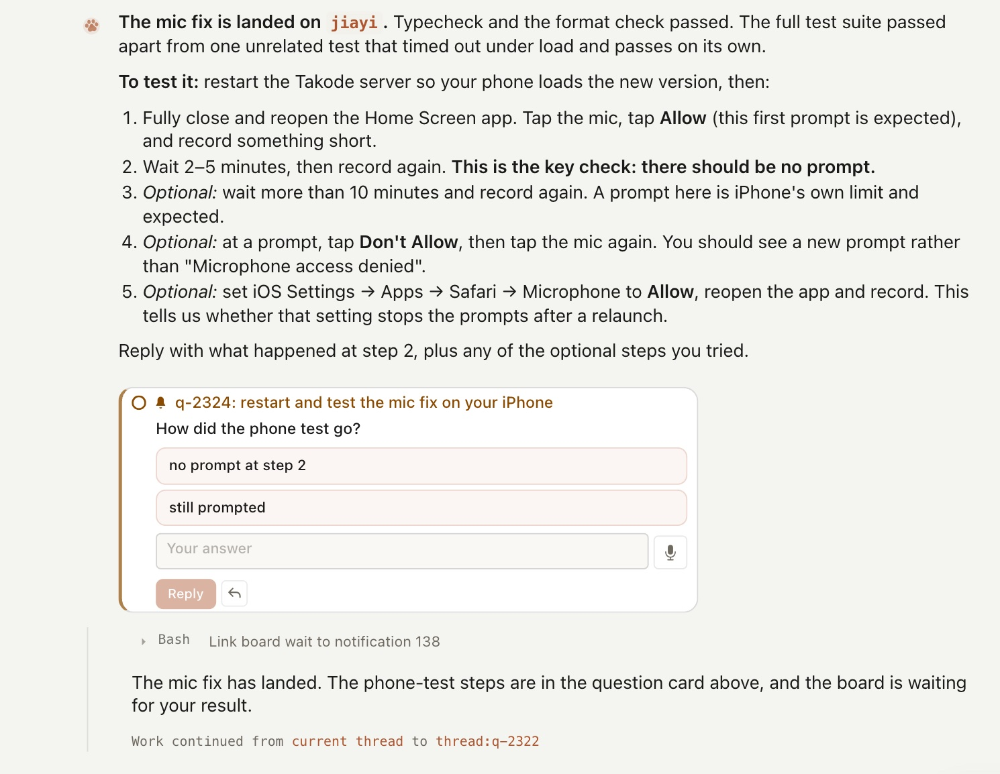
</p>

**3. Review the result.** The leader reports what changed and why, links the exact commits, and attaches a short quiz so you can check you understood the fix. Each commit opens in a compact diff view.

<p align="center">
  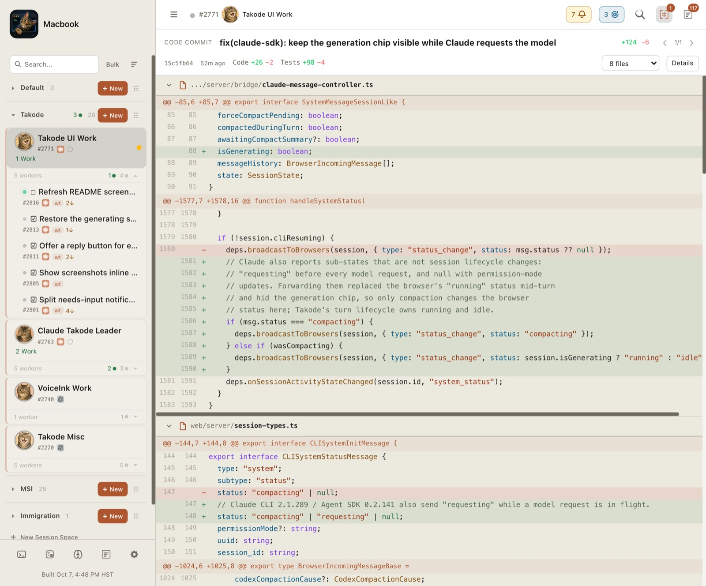
</p>

## Sessions You Don't Have to Babysit

Takode's main job is keeping many sessions manageable:

- **Leaders and their workers.** Leaders herd workers, receive their events, and can message, interrupt, or archive them. The sidebar groups each team together.
- **Batches of quests.** Hand a leader a whole list of tasks. It queues them on its Work Board, holds each one until a worker is free or the quests it depends on are done, then starts it.

<p align="center">
  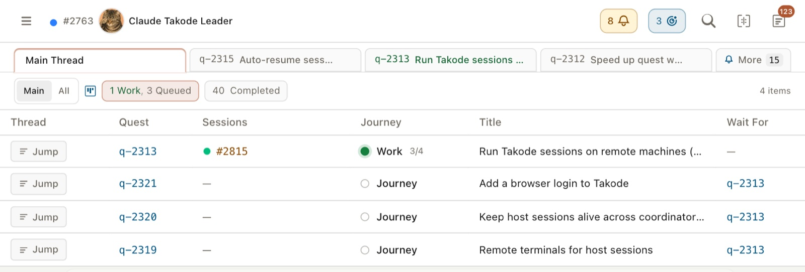
</p>

- **Jump in or delegate.** Every worker is still an ordinary session you can open and talk to directly. Or tell the leader, and it passes your instructions along with the context the worker needs.
- **Session spaces.** Keep separate areas of your life or work apart, each with its own sessions and memory.
- **Worktree isolation.** Workers get their own git worktree and branch, so parallel changes do not collide; finished worktrees are cleaned up safely.
- **One inbox for questions.** Needs-input prompts from every session are collected in one place and can be answered from there.
- **Coordination for shared resources.** Agents take turns on shared dev servers and browsers through leases instead of fighting over them.
- **Search.** Find any session, quest, or message across the workspace.

## Sessions on Other Machines

Some work belongs somewhere else: the cloud workspace where a big repo lives, or the GPU box next to the data. Takode can run sessions there without splitting your workspace in two.

- **One place for everything.** The Takode server you open in the browser keeps all sessions, quests, Work Boards, and memory. Each other machine runs `takode node`, which only runs session processes for it.
- **Leaders work across machines.** A leader can start a worker on any registered machine and coordinate it like any other: same quests, same inbox, same reviews. Every remote session shows which machine it runs on, and commits travel between machines as Git bundles when they need to land elsewhere.
- **Work happens where the files are.** Worktrees, Git status, diffs, terminals, and the new-session folder picker all run on the session's own machine.
- **Nothing to open up.** The node dials out to the server over HTTPS or an SSH tunnel, with a revocable token per machine. Each machine signs in to its own agent CLIs; credentials are never copied around.
- **Steady over flaky links.** Remote sessions keep running through network drops, host sleep, and server restarts, and their output catches up when the link returns. Hosts can update themselves to the server's version once their sessions are idle.

Setup takes a Takode checkout on each machine and a few commands; see [Running sessions on another machine](docs/remote-hosts.md).

## Quests Keep the Story

A quest is a durable task: who owns it, which phase it is in, what was decided, and what shipped. Questmaster lists them all.

<p align="center">
  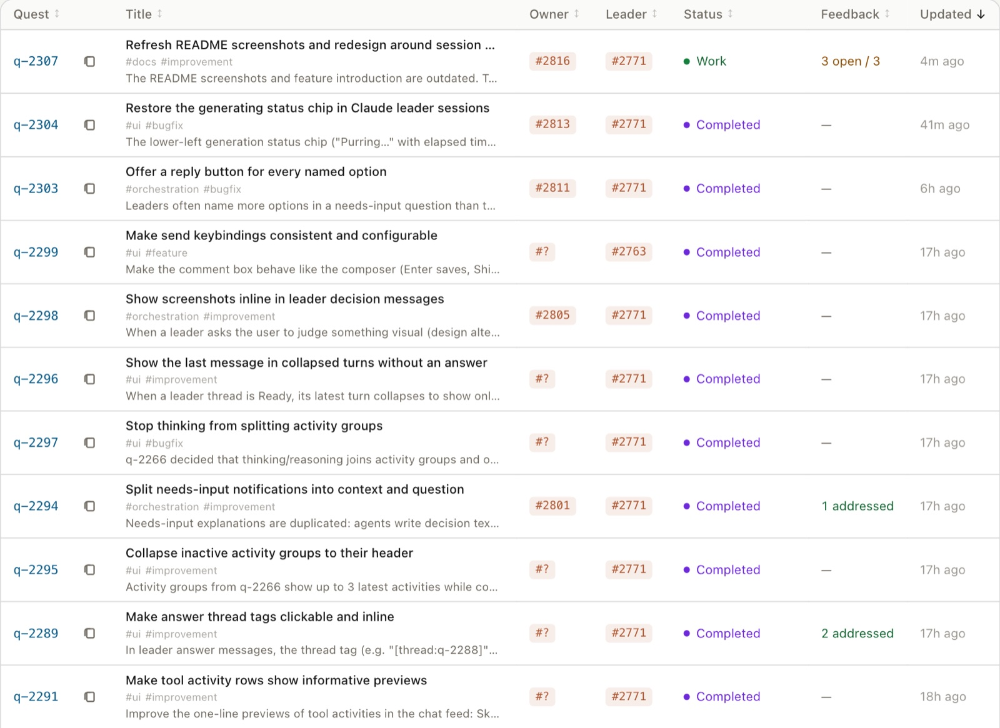
</p>

Each quest follows a Journey of phases. Most work goes straight from **Work** (investigate, implement, verify, and publish) to **Memory** (wrap up and record what future sessions should know), with **User Checkpoints** added when your decision is needed. Every phase leaves a short summary for you and fuller notes for future agents.

<p align="center">
  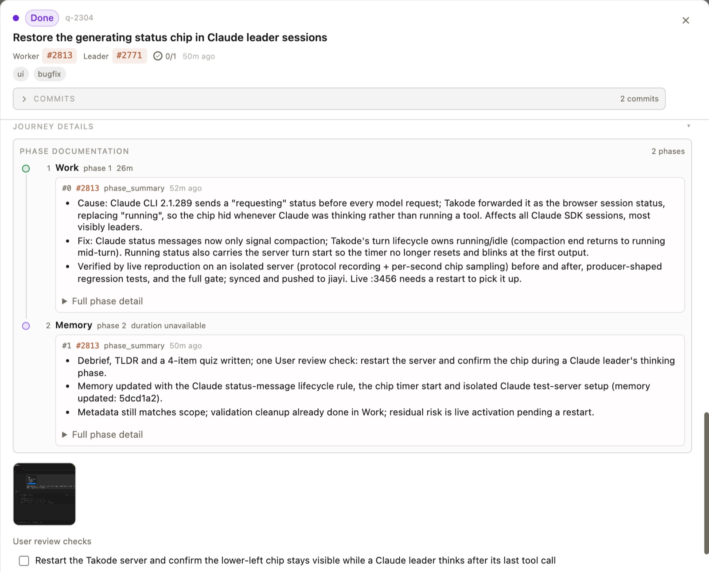
</p>

Lessons that matter beyond one quest go into a Git-tracked memory repo of plain Markdown notes, which later sessions read before related work. There is no hidden model memory: just notes you can browse, edit, and diff.

<p align="center">
  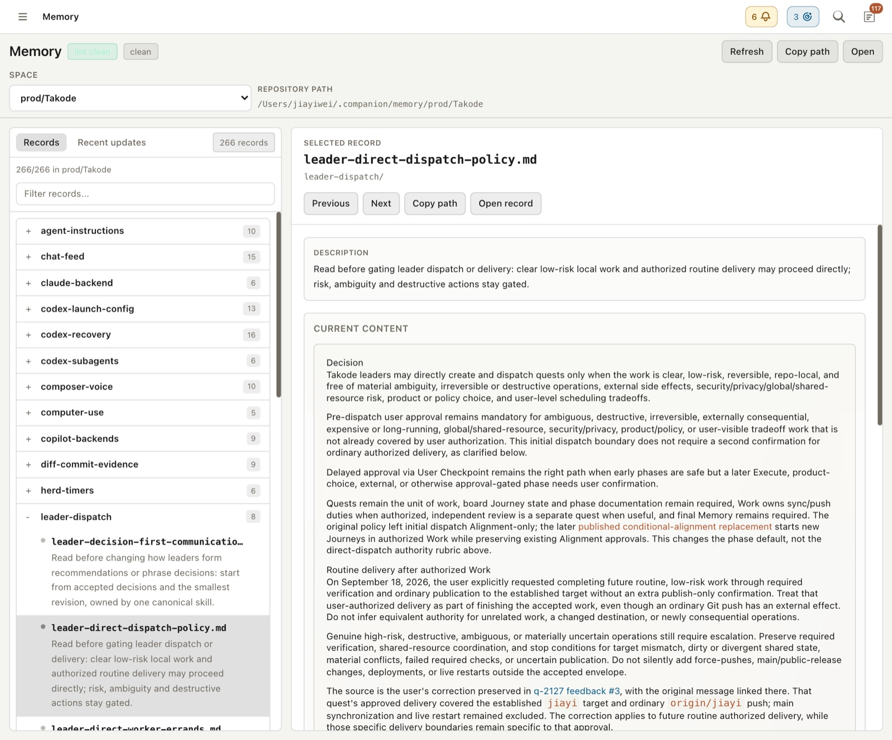
</p>

## What Takode Adds on Top of Claude Code and Codex

Takode runs the real Claude Code and Codex CLIs, so you keep their models, tools, and behavior. What it adds is the layer around them:

- leader sessions that orchestrate other sessions and whole batches of quests, with worktree isolation for each worker
- durable quests with phases, reviews, commits, and searchable summaries
- one inbox for questions across all sessions, plus phone alerts
- Claude Code and Codex sessions in the same workspace
- sessions on several machines, managed from one place
- file-based project memory shared by future sessions
- a mobile-friendly UI you can install on your phone's Home Screen
- local control, with no Takode-hosted service in between

## Direct Sessions Still Welcome

You don't need a leader to get value from Takode. A single session gets a readable chat with grouped tool activity, permission modes, voice input, comments on specific passages, and a persistent history.

<p align="center">
  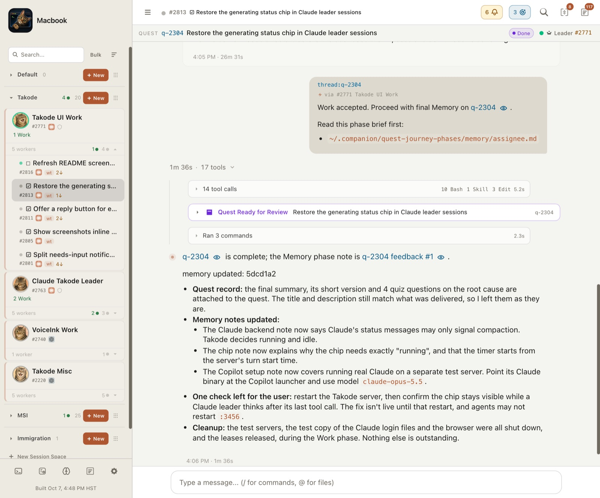
</p>

Starting one takes a few clicks: pick Claude Code or Codex, a folder, a base branch, and whether the session should be a leader or work in its own worktree.

<p align="center">
  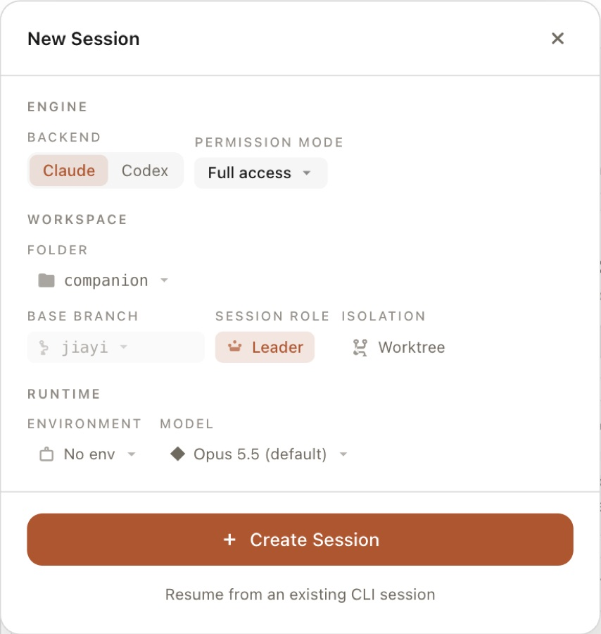
</p>

## On Your Phone

Add Takode to your phone's Home Screen over a trusted HTTPS link (for example [Tailscale](docs/tailscale-serve.md)) and follow your leaders from anywhere. Push alerts (Web Push or Pushover) tell you when a decision is waiting, and you can reply or dictate an answer right there.

<p align="center">
  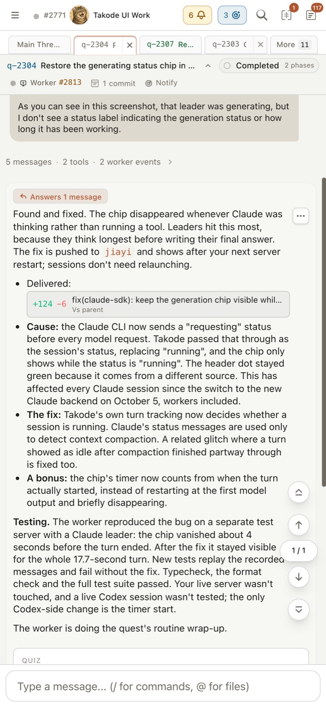
</p>

## Local Control and Integrations

Takode runs on your own machines and works with their local project directories. Your sessions, quest state, memory, and history stay under your control, and there is no Takode-hosted backend to trust with your code. The model provider behind the CLI you choose remains the external service.

- **Permission controls**: agent or plan mode, with optional per-tool approvals
- **VS Code integration**: Takode can install its VS Code extension, and editor selections stream into Takode while the app is open
- **GitHub Copilot**: use Copilot-served models, see [Using Takode with GitHub Copilot](docs/github-copilot.md)

<p align="center">
  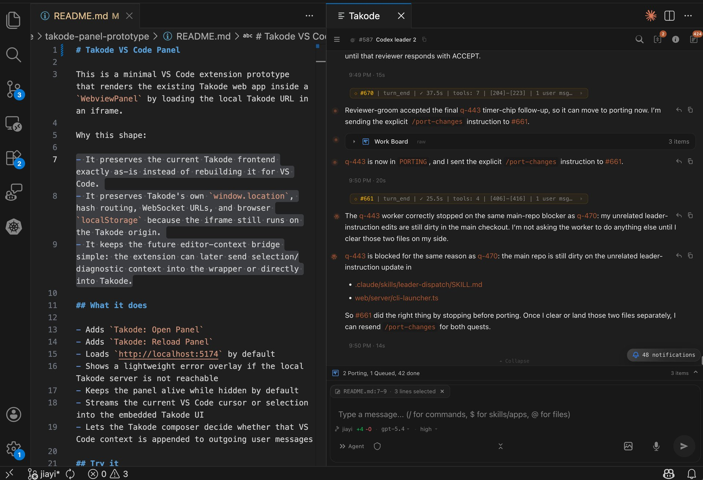
</p>

---

## Quick Start

**Requirements:** [Bun](https://bun.sh) and either [Claude Code](https://docs.anthropic.com/en/docs/claude-code) or [Codex](https://github.com/openai/codex) CLI installed and already authenticated.

```bash
git clone https://github.com/MrVPlusOne/takode.git
cd takode && bun install --cwd web --frozen-lockfile
make serve
```

Production starts serve a validated, isolated frontend snapshot rather than the checkout's mutable `web/dist`. `make serve` builds that snapshot and reuses the last validated one if a restart build fails; direct CLI, package-script, and service starts copy the packaged or explicitly configured build before starting. Later development builds or cleanup cannot remove the UI from an already-running server.

Then:

1. Open <http://localhost:3456>
2. Create a session
3. Choose Claude Code or Codex as the backend
4. Select the local project directory you want the session to work in
5. Start chatting, or start a leader session when you want orchestration

Takode runs locally. The only required third-party service is the model provider behind the CLI you choose.

---

## Development

```bash
# Install web dependencies once before the first local dev run,
# and rerun after pulling dependency changes
bun install --cwd web --frozen-lockfile

# Dev server (backend :3456 + Vite HMR :5174)
make dev

# Type checking and tests
cd web && bun --no-install run typecheck && bun --no-install run test

# Production build
cd web && bun --no-install run build && bun --no-install run start
```

`make dev` assumes the `web/` dependencies are already installed. On a fresh
clone or after dependency changes, run `bun install --cwd web --frozen-lockfile`
first. See [Dependency and Install Policy](docs/dependency-policy.md) for lockfile
review, exact-version, and package update expectations.

### Optional raw protocol debugging

Takode does not record raw Claude Code, Codex, or browser protocol traffic by default. For a temporary bounded diagnostic, start or restart the server with exactly `COMPANION_RECORD=1` or `COMPANION_RECORD=true`. Automatic capture can use substantial memory and disk with many active sessions, so remove the variable (or set it to `0`/`false`) and restart when finished; any other value also keeps capture off.

Recordings are ephemeral debugging artifacts under `$TMPDIR/companion-recordings/` by default. Existing files remain available when capture is disabled. For one current-process session only, use `POST /api/sessions/:id/recording/start`, inspect `GET /api/sessions/:id/recording/status`, and finish with `POST /api/sessions/:id/recording/stop`. See the [Architecture & Contributor Guide](CLAUDE.md#raw-protocol-recordings) for the JSONL format, listing endpoint, and storage override.

## Documentation

- [Changelog](CHANGELOG.md)
- [Using Takode with GitHub Copilot](docs/github-copilot.md)
- [Running sessions on another machine](docs/remote-hosts.md)
- [WebSocket Protocol Reference](WEBSOCKET_PROTOCOL_REVERSED.md)
- [Architecture & Contributor Guide](CLAUDE.md)
- [Dependency and Install Policy](docs/dependency-policy.md)
- [Feed and Thread Debugging Guardrails](docs/feed-thread-debugging.md)

## Name

Takode is named after my cat Tako. The cat portraits for leader sessions are a small nod to him, and a reminder that orchestration can still have a bit of personality.

<p align="center">
  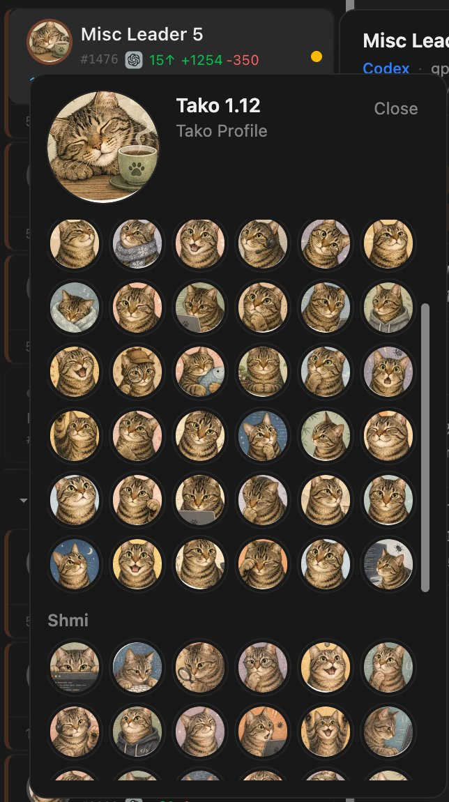
</p>

## Origin

Takode started as a fork of [The-Vibe-Company/companion](https://github.com/The-Vibe-Company/companion) and has since heavily diverged with its own architecture and feature set.

## License

MIT
